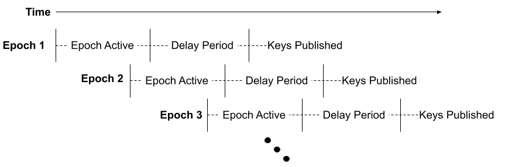
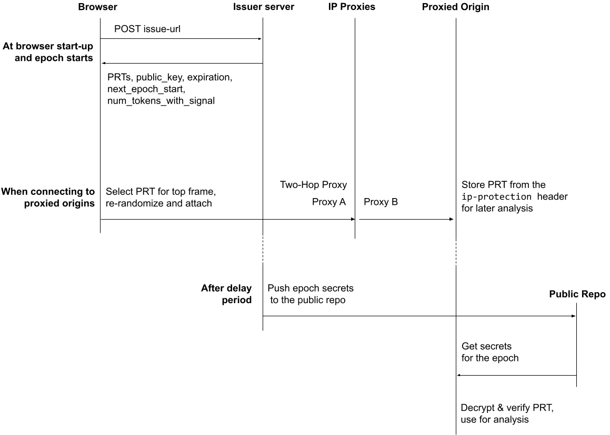

# Probabilistic Reveal Tokens

## Introduction

[IP Protection](https://github.com/GoogleChrome/ip-protection) aims to provide
better protection against cross-site tracking in Incognito mode, however, it
could also impact sites' ability to measure and prevent fraud if done without
appropriate mitigations for this use case. Many websites rely on IP addresses to
defend against fraudulent and spammy behavior, so they can focus on providing a
safe experience to their users. To ensure that all businesses can continue to
estimate the amount of fraud on their systems, train models to defend against
fraud, and analyze emerging fraudulent behavior while still mitigating the
ability to track users at scale using IP addresses, we propose to introduce a
delayed IP sampling mechanism called Probabilistic Reveal Tokens (PRTs)
alongside IP Protection. PRTs attempt to drastically reduce the availability of
IP addresses to websites that present a high risk of tracking, while preserving
the ability to estimate fraud and gain visibility into new attack patterns.

PRTs will be included on proxied requests in a new HTTP header added by the
browser for domains that indicate they want to receive them via a signup
process. Each PRT will contain a ciphertext, generated by an Issuer and
re-randomized for unlinkability by the browser prior to the request, that the
recipient can decrypt after a delay. Google will be the issuer for Chrome's
implementation. A minority of the decrypted PRTs contain the client's pre-proxy
IP address (i.e. non-masked, and as observed by the token issuer), while the
remaining PRTs provide no information about the client's original IP address.
This results in only a small percent of PRTs containing and revealing the user's
IP.

Clients will be able to verify the reveal rate by decrypting the PRTs they
receive using the private keys published by the key coordinator at the end of
each epoch's delay period.

## Goals

-   Enable proxied services to measure invalid traffic (IVT) in aggregate
-   Enable actionable insights, like understanding if a publisher or content
    provider has a particularly high rate of invalid traffic
-   Enable services to update publisher reputation indicators for their traffic,
    that may be applied on un-proxied traffic
-   Enable fraud and spam detection while minimizing IP reveal rate
-   Ensure that cross-site tracking is not re-enabled by this mechanism

## Non-Goals

-   Provide a new mechanism for cross-site tracking
-   Provide insights for ad measurement beyond IVT detection
-   Provide IVT annotations on all masked traffic
-   Provide real time IVT detection
-   Provide a mechanism to reveal the IP on chosen requests

## Use Cases

Many organizations use IP addresses as critical signals for identifying and
mitigating fraud. This signal is used widely across industries and verticals,
and is useful in preventing a variety of attacks like denial of service, account
takeovers, spamming, payment fraud, etc.

For general fraud detection use cases, organizations can supplement their fraud
detection pipelines by updating logs with the revealed IP addresses, and
rerunning models or heuristics to generate fraud insights and reports. Although
only a small percentage of requests will be annotated with an IP address, this
sampled data can be used for manual analysis and help identify new threats.

The initial application of PRTs focuses on the use cases most likely to be
impacted by IP Protection: domains embedded in a third-party context and on the
[Masked Domain List](https://github.com/GoogleChrome/ip-protection/blob/master/Masked-Domain-List.md)
(MDL). Many companies on the MDL are in the business of serving ads, ads
targeting, measuring ad effectiveness, or commerce related activities. These use
cases may rely on detecting fraudulent ad activity through identification of
invalid traffic, bots, or blocklisted IPs. PRTs offer the ability to detect ad
fraud at scale while ensuring that IP Protection works effectively for users.
Embedded third parties on the MDL, like advertisers, remain unable to observe
the IP during a browsing session, and can detect and measure fraud after the
fact using sampled data, all while continuing to help publishers monetize their
sites and continuing to allow users to browse privately.

## Proposed Solution

Probabilistic Reveal Tokens help organizations measure fraud and investigate new
types of attacks while respecting users' privacy during IP-protected browsing.
PRTs utilize re-randomizable ElGamal encryption to make tokens, and repeated
uses of the same issued token, unlinkable.

### Participants

-   **Issuer** - The issuer is an internet-facing service from which the browser
    fetches PRTs. Following the end of the epoch and some delay period, the
    issuer collects the secret key from the key coordinator and publishes it
    along with its HMAC key for token validation.
    -   At launch, Google will be the token issuer
-   **Key Coordinator** - The key coordinator generates the cryptographic
    keypair necessary for token encryption and decryption, and is responsible
    for keeping the secret key material secret while tokens are eligible to be
    spent. This may be implemented as part of the issuer.
-   **Public Key Repository** - Location where secret keys are published to by
    the issuer. Should keep a history of all previously published keys.
    -   Google's issuer will publish secret keys to GitHub
-   **Browser** - The browser fetches tokens from the issuer, re-randomizes them
    to prevent linkability, and sends the tokens to websites. After the key
    material is published, the browser provides tools to allow discerning users
    to validate the privacy properties of the tokens.
-   **Websites** - Receive tokens from the browser. After the key material is
    published, websites validate the legitimacy of the tokens and leverage
    sampled signals.

### Probabilistic Reveal Token Generation

Each epoch will last for one day. Prior to the start of each epoch, the key
coordinator will generate a new ElGamal keypair for encryption, and the issuer
will generate a secret HMAC key necessary for token validation. The public key
will be available at the start of the epoch, and the secret cryptographic key
and HMAC key will be published some time after participants have rotated to a
different set of keys. This delayed release of secrets controls when the PRT can
be decrypted and analyzed. To avoid a thundering herd problem at epoch change,
there will be a small overlap in the active epochs, avoiding all clients having
to fetch new tokens at the same time.



When a client requests a batch of Probabilistic Reveal Tokens, the issuer will
record the client's IP address from the inbound connection. Within a batch of
tokens, some percentage (based on the reveal rate) will contain the client's
observed pre-proxy IP address. The remaining tokens will contain a NULL value
instead of the IP address. The issuer will then generate a message containing
the chosen IP address or NULL, some low-entropy metadata including a token
version, token ordinal, and an HMAC of the token contents. Finally, the issuer
will encrypt each token using ElGamal encryption and return the batch of tokens
to the client.

### Sending Probabilistic Reveal Tokens

When the client creates a request that will be proxied, it checks whether the
destination origin is in the
[registration list](?tab=t.0#heading=h.e7nq9uro0ytn). If the destination is in
the registration list, the client checks whether the top level site already has
an associated PRT. If the client has already associated a PRT with the top level
site and this PRT has not expired, the token's cipher text is re-randomized and
attached to the request. If there is no PRT associated with the top level site
or the PRT is expired, the client randomly picks a PRT from pre-fetched PRTs,
re-randomizes it, and associates it with the top level origin. \
The client includes re-randomized PRTs in the
[Ip-Protection](https://source.chromium.org/chromium/chromium/src/+/main:net/http/http_network_transaction.cc;drc=1651676a30cd7abcd177975f7cd0e37bd945f663;l=1242)
header. Values are base64 encoding of
[TLS Presentation Language](https://datatracker.ietf.org/doc/html/rfc8446#section-3)
serialized `PRTStruct` defined below.

```
struct {
 uint8 version;
 /* size of u and e depends on version, size is 29 for version 1 */
 opaque u<0..2^16-1>;
 opaque e<0..2^16-1>;
 /* Used to identify the corresponding key/secrets to decrypt */
 opaque epoch_id[8];
} PRTStruct;
```

```
Ip-Protection: 1; prt=MWFiY2RlZ...mdoYWI=
```

If there are no valid PRTs to attach when composing a proxied request,
the client will make the proxied request without a `prt` in the header. A
well-behaved client should only fail to attach a PRT in exceptional
circumstances, e.g. Issuer unavailability. As the lack of an attached PRT will
not prevent a request from being proxied, the volume of exceptional
circumstances must be minimized to ensure that a website can treat any
non-trivial amount of proxied traffic missing a PRT as suspicious.



### Making use of Probabilistic Reveal Tokens

After each epoch's delay period, the issuer will publish the private key needed
to decrypt the corresponding batch of PRTs and the HMAC key used to sign
contents. Any interested party can decrypt the PRTs they received during the
corresponding period and verify the reveal rate, ensuring that the issuer is
behaving honestly.

For Google's implementation of the PRT issuer, we will publish keys to Github.
We will update the explainer with the Github repository at launch. 

When an origin receives a PRT, it will store the PRT until the corresponding
private key and HMAC secret are published by the issuer. The origin can then
decrypt the PRT to recover either the client's true IP address or a NULL IP
address. Origins can verify the contents of the token via the HMAC, and ensure
clients are, in aggregate, selecting them randomly from tokens that were issued
to them. Significant deviations from a uniform distribution of ordinal values is
one indicator of potential malicious client activity. The origin can use the
revealed IP addresses as input to their fraud detection pipeline to estimate the
amount of fraud associated with different publishers or other entities and
create denylists to mitigate that fraud.

For more technical information on PRT tokens, [please see here](https://github.com/explainers-by-googlers/prtoken-reference).

### Requesting access

By default, PRTs are not included on proxied requests. Organizations on the MDL
must sign up to receive PRTs in the header as part of the proxied requests using
a forthcoming form. Google will verify that the domain is on the MDL, but will
otherwise not restrict any organization that signs up to receive the tokens.

We use registration to avoid sending PRTs automatically on every proxied
request. The encryption scheme, although performant, uses client resources. As
sites will need to make additional investments to log and analyse PRTs, sending
them automatically would likely waste client resources.

Requiring sites to request tokens for each client, e.g. through an HTTP request
header, also doesn't match the expected usage. A site that makes use of PRTs
likely wants them on all proxied connections, and cannot receive them on
un-proxied connections.

### Tunable Parameters

#### Reveal rate

We are [seeking feedback](https://github.com/GoogleChrome/ip-protection/issues/81) on what a reasonable starting reveal rate should
be. The reveal rate can be modified over time, and a stated goal is to minimize
the reveal rate without impacting sufficient IVT measurement. Given
organizations likely will have a large portion of their traffic unmasked as
non-IP-protected traffic, we may be able to start at a reasonably small reveal
rate around 5-15%.The reveal rate must be high enough to enable reasonable
detection of attacks occurring exclusively in masked traffic.

#### Epoch & Delay Period length

We expect the epoch and delay period lengths to begin at one day each, but are
open to feedback on reasonable lengths of time. Please leave your feedback in
[this github issue](https://github.com/GoogleChrome/ip-protection/issues/82) to explain your rationale for the timing. The delay
period should be long enough such that it is impractical to associate revealed
tokens back to a current user session, but not so long in combination with the
epoch length that it is difficult to reprocess events and compile fraud
measurements.

## Privacy & Security Considerations

### Ciphertext Re-randomization

The ability to re-randomize a token's ciphertext, without changing the
underlying contents (a property of the ElGamal encryption scheme used),
underpins many of the security and privacy properties of PRTs. The issuer cannot
link a re-randomized token's ciphertext back to any tokens it issued, and
origins that receive re-randomized versions of the same token cannot link them
together.

Before sending a token on a connection to a particular 1P/3P pair, the client
re-randomizes the ciphertext for that token to make it unlinkable to any other
usage of the token for other 1P/3P pair requests. The client will cache the
cyphertexts for each 1P/3P pairing and reuse them on subsequent requests while
the underlying token remains valid. Received tokens may be stored by origins in
partitioned storage, and so more granular re-randomization (e.g. per request) is
unnecessary.

As re-randomization is a non-trivial computational operation the client may,
without loss of privacy or security, choose to pre-randomize tokens, ready for
attaching to connections.

### PRT affinity to Top-Frame Site During a Delay Period

A single issued PRT is assigned to a top-frame site during a user session to a
maximum of the delay period length, and all proxied requests to the embeds on
the site will have the same PRT. As the delay period is much longer than typical
user sessions, effectively all embedded origins will either see the revealed IP
or receive NULL (at roughly the reveal rate) for that session. A user session is
defined by the lifetime of site accessible storage, which in Chrome will be the
length of the Incognito session.

If the client were to choose independent PRTs for each proxied request and
embedded domain, it would be possible for websites to improve their odds of
getting a PRT with the user's original IP address by increasing the number of
origins they have on a page, i.e., multiple requests with PRTs attached, or by
partnering with other embedded domains and sharing their data.

Although every embedded origin will receive the same underlying token, the
re-randomization of the token's ciphertext ensures that these tokens remain
unlinkable outside the context of the page. Within the context of a page,
origins may choose to share via
[postMessage()](https://developer.mozilla.org/en-US/docs/Web/API/Window/postMessage) -
but because of the 1P affinity, they do not gain any additional information by
doing so.

### Token Ordinal Metadata

Token ordinals prevent a malicious client from choosing one token and
re-randomizing it an arbitrary number of times. This would enable an attacker to
generate an unbounded set of tokens that *all* either reveal the IP, or NULL.
The attacker will *not know which* property the set of tokens has, but being
able to know that they all share *the same* property, would make some attacks
more feasible.

To mitigate these types of attack, for each requested batch of tokens, the
issuer will record the order of the token as the token's "ordinal" (i.e. the
first token has ordinal 1, the second token ordinal 2, etc.) and then shuffle
the tokens. This field does not convey information about the client requesting
tokens, since each batch of tokens has the full set of ordinal IDs. An origin
can keep the complete set of unique token ciphertexts it receives during an
epoch (noting that ciphertexts are reused on requests for the same 1P/3P pair),
and look at the total, and per top frame, ordinal value distribution.

Websites will expect a uniformly random distribution of token ordinal values
across their users and spikes of specific token ordinals may be indicative of an
attacker re-randomizing the same token across different sessions they control.
Websites can then apply additional scrutiny to activities associated with these
spikes in the distribution. We expect token batch sizes (and so the maximum
ordinal) to initially be 100, which will enable websites that receive thousands
of tokens to build meaningful distributions.

### IP Address Mismatch

The IP address a client fetches tokens from, and so is seen to the issuer and
probabilistically included in tokens, may be different from the IP address used
to later connect to un-proxied origins, or the IP proxy itself. There are many
reasons this could occur, from a user changing WiFi networks, to an ISP
dynamically assigning a new IP. This drift in IP address may result in a PRT
revealing an IP address that is unexpected from the user's perspective (e.g. the
user's work vs. personal network IP address).

Browsers can reduce the chance of IP address mismatch by fetching tokens close
to when they are spent, and closely aligned with user expectations. In Chrome,
tokens will be fetched at the start of each new Incognito session.

### Timing Attacks

Web APIs that rely on allocating resources to a specific site must take care not
to introduce any timing attacks. Specifically it is critical to ensure that
there is no observable timing difference between retrieving an already allocated
PRT and allocating a new PRT. Implementations should make sure that the pathways
for retrieving already assigned tokens and allocating new random tokens are
indistinguishable timing wise. Similarly, implementations should ensure that new
PRT batches are automatically requested sufficiently in advance of a new epoch
to ensure that allocating a PRT is always a constant-time operation.

## Browser-Specific Considerations

### User Control

PRTs are only sent when IP Protection is enabled, and only on requests that IP
protection causes to be proxied. When a user disables IP Protection this also
disables PRTs. The ability to detect and act on fraud using our additional
privacy protections is a key component of responsibly launching those
protections.

### Developer Tools & Token Inspection

Developers and users can view PRTs passed in the header for proxied requests, if
passed, using the Network tab of Developer Tools.

Some advanced users may wish to record their own PRT activity for better
transparency. When the `IPPrivacyStoreProbabilisticRevealToken`
[feature flag](https://chromium.googlesource.com/chromium/src/+/HEAD/docs/how_to_add_your_feature_flag.md)
is enabled, Chrome stores all PRTs received in the
`IPPrivacy/ProbabilisticRevealToken/` directory. Chrome will store this to the
disk even in incognito sessions. As this data reveals information about
Incognito usage, exported data will be limited to the fetched tokens themselves,
and not any information about where they were sent. This feature is disabled by
default. We will release tools that make this analysis easier.

### Have Feedback?

We welcome your feedback on this proposal. Please use the following link to
provide your input in our GitHub repository:

https://github.com/explainers-by-googlers/prtoken-reference
